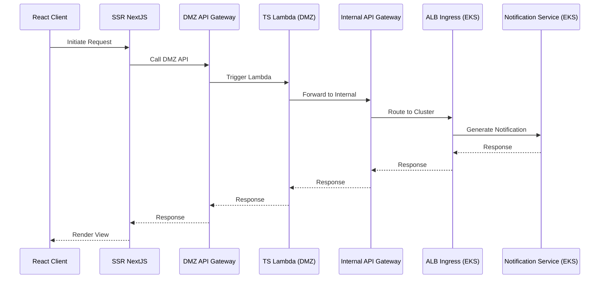

# Notification Service

An enterprise-grade platform responsible for routing and delivering messages across multiple channels. It acts as a central hub for all outbound communications, ensuring reliability, observability, and auditability.

## System Architecture & Design Specification

The system uses a highly integrated VPC architecture to route internal events securely. The application code strictly enforces **Hexagonal Architecture** (Ports and Adapters), isolating business logic from input triggers and external delivery mechanics.

### Web & Network Topology

- **Internal VPC**: Contains the Internal API Gateway and the EKS cluster running the core Java 21 Spring Boot Notification Service.
- **Routing Flow**: Internal request ➔ Internal API Gateway ➔ ALB Ingress Controller ➔ Spring Boot services on EKS.

### Data Flow Diagram

### Core Architecture Components

- **Core Domain**: Contains templating engine integrations, core audit definitions, business rules for evaluating flags, and generic notification behaviors.
- **Inbound Ports (Primary)**: REST APIs, structurally defined and constrained by an initial contract-first OpenAPI specification.
- **Outbound Ports (Secondary)**: Abstractions for Notification Channel Gateways, Auditing Repositories, and Telemetry/Feature flag providers.
- **Adapters**: Concrete implementations wrapping external APIs (e.g., Salesforce Email API), standard console/HTTP event emitters, PostgreSQL audits, etc.

### Technology Stack Overview

- **Backend**: Spring Boot 4.0.3 (Java 21 LTS), Gradle.
- **Testing (API)**: Playwright for automated E2E REST validation.
- **Simulation**: A standalone DuckDB/CSV backed simulator proxy for local mocking of third-party network channels.
- **Cross-cutting Concerns**: OpenTelemetry (Observability) and OpenFeature (Feature Flagging).